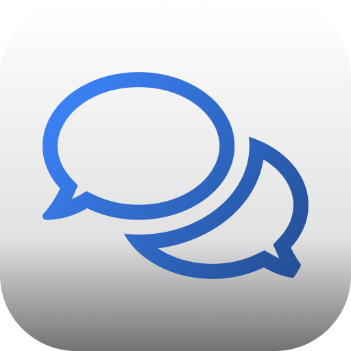
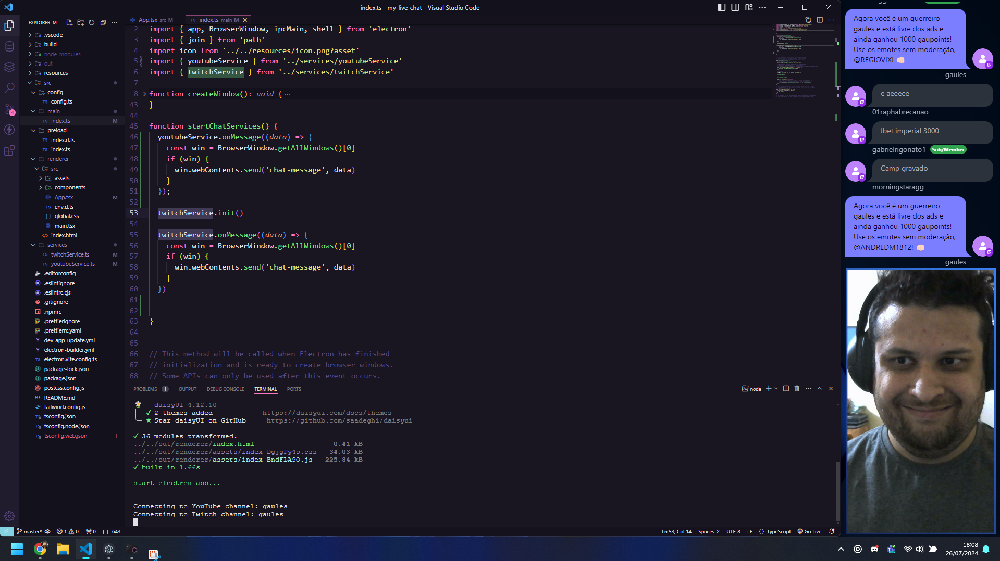

<p align="center">
  
</p>

<h1 align="center">Mini Chat Overlay</h1>
<p align="center">Mini Chat Overlay for Twitch and Youtube chats using Electron + Vite + React and TypeScript.</p>

<h3 align="center">

  <!-- Version -->
  <a href="https://github.com/filipeleonelbatista/mini-chat-overlay/releases">
    
  </a>  
  
 <!-- License -->
  <a href="./LICENSE" target="_blank">
    
  </a>
</h3>

<br />



# Installation

- [Download](https://github.com/filipeleonelbatista/mini-chat-overlay/releases)

---

# How to Create a Bot on Discord and Get IDs to use your chat on discord if needed

## 1. Create the Bot on the Discord Developer Portal

### Step 1: Access the Discord Developer Portal
- Go to the [Discord Developer Portal](https://discord.com/developers/applications).
- Log in with your Discord account.

### Step 2: Create a New Application
- At the top of the page, click **New Application**.
- Give your bot a name and click **Create**.

### Step 3: Create the Bot
- In the side menu, click **Bot**.
- Click the **Add Bot** button and confirm.
- The bot has been successfully created!

### Step 4: Get the Bot Token
- On the bot page, you will see a section called **Token**.
- Click the **Reset Token** button to generate a new token. - **Important**: Copy this token and store it in a safe place, as you will need it to connect your bot to your application. **Never share this token publicly**.

## 2. Add the Bot to the Server

### Step 1: Get the Client ID
- In the side menu of your application in the Discord Developer Portal, click on **General Information**.
- Copy the **Client ID** (which will be used to generate the invite link).

### Step 2: Generate the Invite Link
- To add the bot to your server, use the following URL, replacing `CLIENT_ID_OF_YOUR_BOT` with the Client ID you copied:

```
https://discord.com/oauth2/authorize?client_id=CLIENT_ID_OF_YOUR_BOT&scope=bot&permissions=8
```

- Example with a fictitious Client ID:

```
https://discord.com/oauth2/authorize?client_id=1288131476084494367&scope=bot&permissions=8
```

### Step 3: Invite the Bot to the Server
- Paste the link into your browser and press Enter.
- Choose the server you want to add the bot to (you must be a server administrator).
- Click **Authorize**.
- Complete the captcha (if necessary).

Now the bot will be on your server!

## 3. Enable Developer Mode to Get IDs

### Step 1: Enable Developer Mode
- Open Discord.
- Click on the **settings** icon (next to your username, in the bottom left corner).
- In the side menu, scroll down to the **Advanced** section.
- Enable the **Developer Mode** option.

### Step 2: Get the Channel ID
- Go to the server and find the channel you want the bot to act in.
- Right-click on the channel (in the left panel).
- In the menu that appears, select **Copy ID**.

### Step 3: Get the Server Owner's ID (optional)
- In Discord, right-click on the server owner's username or on your own name (if you are the owner). - Select **Copy ID**.

Now you have all the IDs you need to configure your bot!

## 4. Configure the Bot in Your Project

### Example Configuration `config.json`
```json
{
"discordToken": "YOUR_DISCORD_BOT_TOKEN",
"discordChannelId": "CHANNEL_ID",
"discordOwnerId": "CHANNEL_OWNER_ID"
}
```

- **discordToken**: Bot token that you got from the Discord Developer Portal.
- **discordChannelId**: The ID of the channel where the bot will act (copied in Step 2 of getting the channel ID).
- **discordOwnerId**: The ID of the server owner (optional, used to identify the owner in the code).

Done! You can now use this information to configure the bot and have it interact with your Discord server.

### How to Enable and Configure Discord Bot Intents

When creating a Discord bot, certain "intents" are required to allow your bot to listen to specific events such as messages, guild interactions, and more. If your bot is receiving an error like:

```
Error: Used disallowed intents
```

This means your bot is trying to use intents that haven't been enabled in the Discord Developer Portal. Here's how to fix this issue:

## 1. Enable Intents in the Discord Developer Portal

### Step 1: Open the Discord Developer Portal
1. Go to the [Discord Developer Portal](https://discord.com/developers/applications).
2. Log in with your Discord account.
3. Select the application for your bot.

### Step 2: Enable Required Intents
1. In the menu on the left, click **Bot**.
2. Scroll down to the section labeled **Privileged Gateway Intents**.
3. Enable the following intents as required by your bot:
   - **MESSAGE CONTENT INTENT**: Enable this if your bot needs to read the content of messages.
   - **SERVER MEMBERS INTENT**: Enable this if your bot needs to access information about members in the server.
4. Save the changes.

## 3. Test Your Bot

After enabling the necessary intents both in the Discord Developer Portal and your code, restart application

This should resolve the issue related to disallowed intents. 

By following these steps, your bot should be able to use the necessary intents without encountering the "disallowed intents" error.

---

# Contributing

Clone de repository, open its folder and install dependencies with:

```sh
yarn
```

Run it using:

```sh
yarn dev
```

# Author

👤 **Filipe Batista**

- Instagram: [@filipeleonelbatista](https://instagram.com/filipeleonelbatista)
- Github: [@filipeleonelbatista](https://github.com/filipeleonelbatista)
- LinkedIn: [@filipeleonelbatista](https://linkedin.com/in/filipeleonelbatista)

## Show your support

Give a ⭐️ if this project helped you!


---

<h3 align="center" >Let's connect 😉</h3>
<p align="center">
  <a href="https://www.linkedin.com/in/filipeleonelbatista/">
    
  </a>&ensp;
  <a href="mailto:filipe.x2016@gmail.com">
    
  </a>&ensp;
  <a href="https://instagram.com/filipeleonelbatista">
    
  </a>
</p>
<br />
<p align="center">
    Developed 💜 by Filipe Batista
</p>